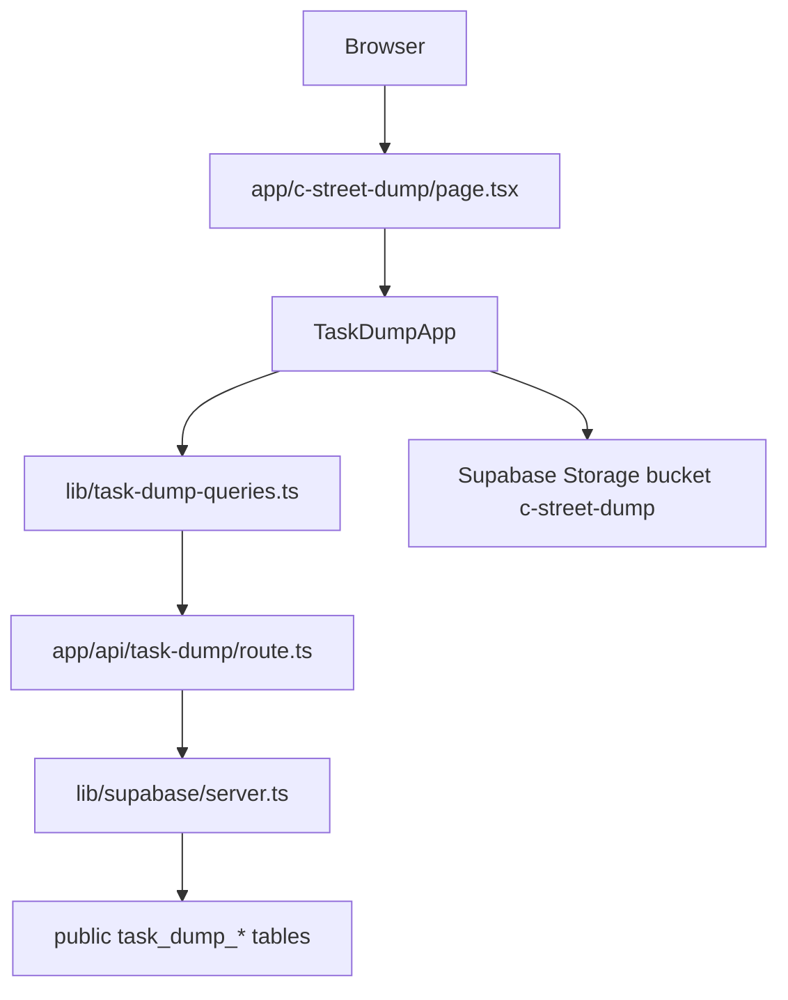

# C-Street Dump Architecture

## Design Goal

This feature is intentionally built as a detachable island inside the repo.

The main strategy is:

1. Keep routing separate under `app/c-street-dump`.
2. Keep feature UI under `features/task-dump`.
3. Keep data contracts in `lib/task-dump-*`.
4. Keep the database isolated in a dedicated `task_dump_*` table namespace.
5. Limit shared-app edits to navigation and global providers only.

## Runtime Flow

## Data Model

### `public.task_dump_tasks`

- Core task row
- Supports titleless quick creation by allowing `body`-only rows
- Stores status, due date, priority flag, soft-delete timestamp, and per-column ordering

### `public.task_dump_task_workspace_blocks`

- Extra text areas attached to a task
- Intended for drafts, scratchpads, reminders, or any other secondary note area

### `public.task_dump_task_attachments`

- Metadata for files attached to a task
- Actual file contents live in Supabase Storage

### `public.task_dump_thoughts`

- Separate lightweight message-board stream
- Also soft-deletable

### `public.task_dump_thought_attachments`

- Metadata for files attached to a thought

## Editing Model

- Non-title fields use a markdown-first editor instead of a heavy rich-text framework.
- In modals, formatting controls are focus-only inline controls (`toolbarVariant=\"focus-inline\"`) so inactive editors stay visually quiet.
- The editor renders rich text while typing but persists markdown to the database.
- Markdown-looking paste input is parsed and rendered as formatted content inside the editor.
- Keyboard shortcuts map to formatting actions (bold/italic/underline/lists/checkbox/divider).
- `===` is converted into a markdown divider so AI-generated or markdown-like text stays compatible with the renderer.
- Save propagation is debounced and version-guarded to prevent stale API responses from overwriting newer local edits.
- If both title and body/content are temporarily blank, autosave is deferred until content is reintroduced, avoiding validation churn while rewriting.

## Why The API Uses A Dedicated Route

The rest of the app mostly talks to Supabase from the browser against `public` tables.

`C-Street Dump` instead talks to the database through `app/api/task-dump/route.ts` using the existing server-side Supabase client against a dedicated `task_dump_*` table namespace in `public`. That keeps this feature out of the tracker's existing table set while avoiding any extra Supabase schema-exposure config or `DATABASE_URL` requirement.

## Extraction Strategy

If this feature is moved to another repository later, the primary set of files to carry over is:

- `app/c-street-dump/*`
- `features/task-dump/*`
- `lib/task-dump-*`
- `app/api/task-dump/route.ts`
- `supabase/migrations/20260306_create_c_street_dump.sql`

The remaining shared concerns to replace in the new host app would mainly be:

- auth gate
- theme provider
- global toaster
- route entry point/navigation link
